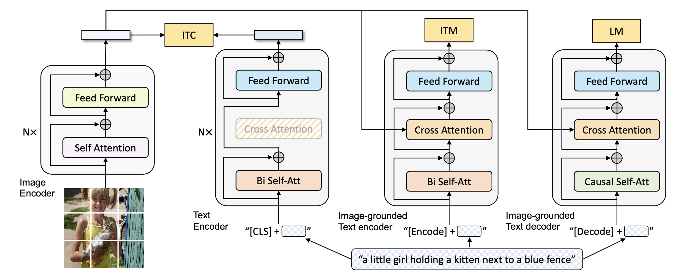
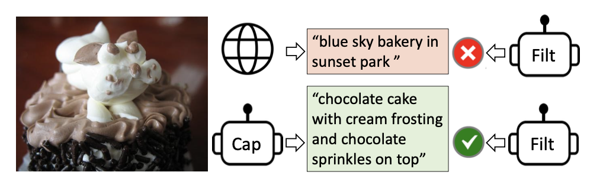

# BLIP-Bootstrapping-Language-Image-Pre-training

A presentation and implementation of the paper "BLIP: Bootstrapping Language-Image Pre-training for Unified Vision-Language Understanding and Generation" by Junnan Li, Dongxu Li, Caiming Xiong, Steven Hoi (Salesforce Research).

## Paper Overview

BLIP introduces a new vision-language pre-training framework that excels in both understanding and generation tasks. The paper addresses two major limitations in existing vision-language models:

1. Model Perspective: Previous models were either good at understanding tasks (like image-text retrieval) or generation tasks (like image captioning), but not both.

2. Data Perspective: Models relied heavily on noisy web-scraped data, which is suboptimal for learning.

### Key Innovations


*Figure: Pre-training model architecture and objectives of BLIP*

1. **MED (Multimodal mixture of Encoder-Decoder)**
   - A unified architecture with three functionalities:
     - Unimodal encoder
     - Image-grounded text encoder
     - Image-grounded text decoder

2. **CapFilt (Captioning and Filtering)**
   
   *Figure 1 from paper: CapFilt bootstrapping process*
   - Bootstraps training data through:
     - Caption generation for web images
     - Filtering of noisy captions

[Previous content remains the same until Key Innovations]

### Discussion Questions for Deeper Understanding

1. **Nucleus Sampling vs Beam Search**
   
   Question: "Why does BLIP use nucleus sampling instead of beam search for generating synthetic captions, even though nucleus sampling has a higher noise ratio (25% vs 19%)?"
   
   Discussion Points:
   - Nucleus sampling generates more diverse and surprising captions
   - Beam search tends to produce "safe" but common captions
   - More diverse captions provide richer training signals
   - Paper's ablation studies (Table 2) show better performance with nucleus sampling despite higher noise

2. **Parameter Sharing Strategy**
   
   Question: "BLIP's architecture shares all parameters between the encoder and decoder except for the self-attention layers. What motivated this specific design choice?"
   
   Discussion Points:
   - Encoder requires bidirectional attention for understanding
   - Decoder needs causal attention for generation
   - Sharing other parameters improves efficiency (reduces model size)
   - Ablation studies (Table 3) show performance degradation when sharing all parameters
   - Balance between model efficiency and task-specific requirements

## Implementation Demo

The repository includes a Jupyter notebook demonstrating BLIP's key functionalities:
- Image Captioning
- Visual Question Answering
- Image-Text Matching

### Setup
```
pip install -r requirements.txt
```

## Key Results

### Image-Text Retrieval (Tables 5 & 6 in paper)
- BLIP (14M images) vs ALBEF:
  - COCO: +2.7% improvement in average recall@1
  - TR@1: 80.6% (+3.0%)
  - IR@1: 63.1% (+2.4%)
- Zero-shot Performance on Flickr30K:
  - TR@1: 94.8% (+0.7% over ALBEF)
  - IR@1: 84.9% (+2.1% over ALBEF)
- Outperforms models trained on much larger datasets:
  - Surpasses ALIGN (1.8B images) with only 14M images
  - Achieves better results than SimVLM with 13× less training data

### Image Captioning (Table 7 in paper)
Performance on NoCaps validation set:
- Overall CIDEr: 105.1 (+4.7 over previous SOTA)
- Breakdown by domain:
  - In-domain: 111.3 CIDEr
  - Near-domain: 104.5 CIDEr
  - Out-domain: 102.4 CIDEr
- COCO Caption test set:
  - BLEU@4: 38.6
  - CIDEr: 129.7

### Visual Question Answering (Table 8 in paper)
- VQA test-dev: 77.54% (+1.7% over ALBEF)
- VQA test-std: 77.62%
- Achieved with simpler architecture and less pre-training data

### Video-Language Zero-shot Transfer (Tables 10 & 11 in paper)
- Text-to-video retrieval on MSRVTT:
  - R@1: 43.3% (surpassing specially designed video models)
  - MdR: 2.0
- Video QA zero-shot performance:
  - MSRVTT-QA: 19.2%
  - MSVD-QA: 35.2%

## Critical Analysis

### Major Strengths
1. Architectural Innovation:
   - Successfully unifies understanding and generation tasks
   - Efficient parameter sharing between encoder and decoder
   - Flexible architecture that can be adapted for different tasks

2. Data Efficiency:
   - Achieves SOTA with fewer training images
   - CapFilt demonstrates quality over quantity in training data
   - Effective use of synthetic captions

3. Zero-shot Capabilities:
   - Strong performance on unseen tasks
   - Impressive transfer to video domain
   - Robust cross-modal understanding

### Areas for Further Development

1. Scalability Challenges:
   - Computational cost of CapFilt for larger datasets not fully explored
   - Need for investigation of optimal scaling strategies
   - Trade-off between data quality and processing time
   
2. Technical Limitations:
   - Limited temporal modeling for video tasks
   - Fixed image resolution constraints (384×384 pixels)
   - Dependency on pre-trained vision transformer

3. Methodological Opportunities:
   - Multiple rounds of dataset bootstrapping not explored
   - Potential for ensemble approaches in captioning and filtering
   - Investigation of different sampling strategies beyond nucleus sampling

4. Data Considerations:
   - Limited evaluation on non-English languages
   - Bias analysis of synthetic captions not performed
   - Need for more diverse validation datasets

5. Implementation Aspects:
   - Memory requirements for large-scale deployment
   - Inference time optimization possibilities
   - Integration challenges with existing systems

6. Future Research Directions:
   - Extension to multi-modal tasks beyond vision-language
   - Investigation of self-improving capabilities
   - Application to domain-specific tasks
   - Potential for few-shot and zero-shot learning improvements
   - Integration with emerging transformer architectures

7. Practical Considerations:
   - Real-world deployment challenges
   - Model compression possibilities
   - Fine-tuning strategies for specific applications
   - Environmental impact of training process

## Citation
@article{li2022blip,
  title={BLIP: Bootstrapping Language-Image Pre-training for Unified Vision-Language Understanding and Generation},
  author={Li, Junnan and Li, Dongxu and Xiong, Caiming and Hoi, Steven},
  journal={arXiv preprint arXiv:2201.12086},
  year={2022}
}